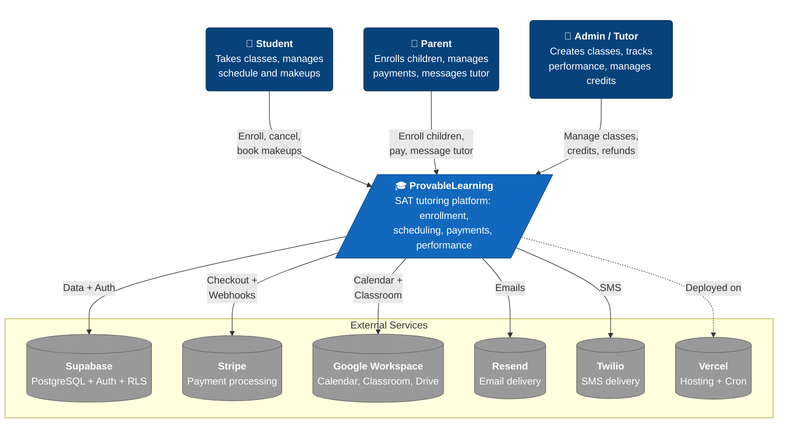
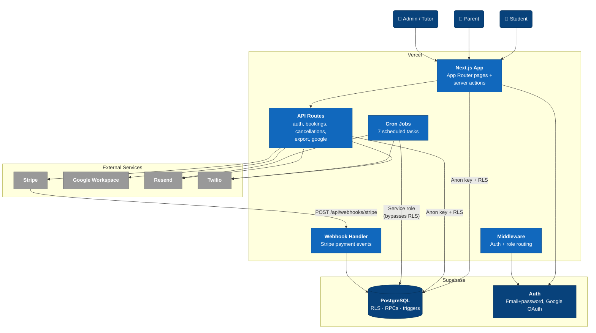
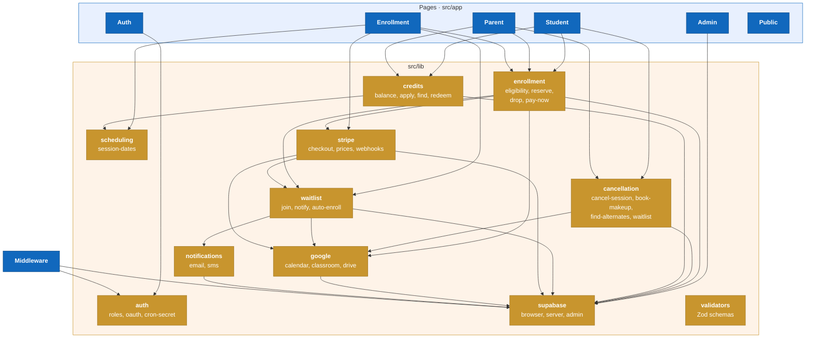

# Architecture (C4)

Three zoom levels — Context → Container → Component — with a glossary at the bottom. Start at Context and drill down as needed.

---

## Glossary

| Term | Meaning |
|------|---------|
| **Enrollment** | A student's registration in a class, with payment status and session schedule |
| **Dual-slot** | SG/1:1 enrollments pick two weekly time slots (`slot_1_class_id`, `slot_2_class_id`) |
| **Session** | A single class meeting; computed from enrollment start date + slot schedule |
| **Credit** | Earned when a session isn't made up by Sunday (SG/1:1 only); redeemable for a makeup |
| **Makeup** | A session booked to replace a cancelled one — any compatible open slot |
| **Waitlist** | FIFO queue when a class is full; LG auto-enrolls, SG offers to notify-then-accept |
| **Makeup Waitlist** | FIFO queue for a specific makeup slot that's full |
| **Drop** | Withdrawing from a class (3-phase system based on timing vs. start date) |
| **Pay Later** | Enrollment reserved without payment; auto-unenrolled if unpaid past deadline |
| **RPC** | Postgres stored procedure (e.g., `reserve_seat`, `apply_credits`) |
| **RLS** | Row-Level Security — Postgres policies restricting access by role |
| **Subject Category** | Subject stored on enrollment (not class): `dsat_rw`, `dsat_math`, `dsat_rw_math`, `general_math` |
| **Group Size Types** | `large` (10–20, $20/mo), `small` (1–3, $300/mo), `one_on_one` (1, $800/mo) |

---

## Level 1 — System Context

The system as a black box, its users, and external services.

### Actors
| Actor | Role | Key actions |
|-------|------|-------------|
| **Student** | End user (independent or child of a parent) | Browse/enroll, cancel sessions, book makeups, redeem credits, view performance |
| **Parent** | Guardian of one or more students | Enroll children, pay, cancel on behalf of children, message tutor |
| **Admin / Tutor** | Platform operator (seed-only, no self-registration) | Create/manage classes, log performance, issue credits, process refunds |

### External Systems
| System | Purpose | Integration |
|--------|---------|-------------|
| **Supabase** | Postgres + Auth (email/password + Google OAuth) | `@supabase/ssr` + `@supabase/supabase-js` + admin client (service role) |
| **Stripe** | Payments | SDK — checkout sessions + `checkout.session.*` webhooks |
| **Google Workspace** | Calendar (schedules), Classroom (materials), Drive (folders) | `googleapis` SDK + service account |
| **Resend** | Email | `resend` SDK |
| **Twilio** | SMS | `twilio` SDK |
| **Vercel** | Hosting + cron | Next.js deployment with 7 cron jobs |

---

## Level 2 — Container

Runtime containers and data flow.

### Next.js App — Page route groups
| Group | Description |
|-------|-------------|
| `(auth)/` | Login, signup, onboarding, password reset, OAuth callback |
| `(dashboard)/student/` | Dashboard, payments, cancel session, drop class, redeem credit, refund |
| `(dashboard)/parent/` | Dashboard, add student, payments, cancel session, drop class, redeem credit, refund |
| `(dashboard)/admin/` | Classes, students, performance, credits, makeups, bookings, refunds, messages, calendar, export, logs |
| `enroll/` | Class browser, slot selection + Stripe checkout, waitlist-offer acceptance |
| Public | Landing (`/`), offerings (`/offerings`), booking (`/book`) |

### API Route Groups
| Group | Purpose |
|-------|---------|
| `/api/auth/` | OAuth callbacks, Google setup, signout |
| `/api/bookings/` | Create booking, available slots |
| `/api/cancellations/` | Reschedule, alternate sessions |
| `/api/export/` | CSV data export |
| `/api/google/` | Create calendar, backfill, nuke classes |
| `/api/webhooks/stripe` | Payment event processing |

### Cron Jobs (`vercel.json`)
| Job | Schedule | Purpose |
|-----|----------|---------|
| `/api/cron/reconcile` | Daily 6 AM | Catch missed Stripe webhooks |
| `/api/cron/waitlist-notify` | Every 5 min | Process waitlist queue, expire offers, auto-enroll |
| `/api/cron/backup` | Weekly Sun 3 AM | Database backup |
| `/api/cron/reports` | Monthly 1st 8 AM | Reports (stub) |
| `/api/cron/cancel-credits` | Every 6 hours | Issue credits for missed makeups |
| `/api/cron/booking-reminders` | Hourly | Upcoming session reminders |
| `/api/cron/auto-unenroll` | Daily 6 AM | Cancel active+unpaid past payment deadline |

All cron routes guard with `CRON_SECRET` header.

### Supabase Postgres
90+ migrations define: core tables (`users`, `students`, `classes`, `enrollments`, `credits`, `waitlist`, `makeup_bookings`, etc.), RLS policies, RPCs (`reserve_seat`, `apply_credits`, `book_makeup_session`, etc.), triggers (role immutability, phone enforcement, agreement immutability), CHECK constraints.

### Middleware (`src/middleware.ts`)
Auth enforcement (redirects to `/login`), role-based access control, Supabase session refresh. Public routes: `/`, `/login`, `/signup`, `/book`, `/offerings`, `/api/auth/*`, `/api/webhooks/*`, `/api/cron/*`, `/api/bookings/*`.

---

## Level 3 — Component

Library modules inside `src/lib/` and how pages consume them.

### Module responsibilities

| Module | Files | Responsibility |
|--------|-------|----------------|
| **enrollment** | `check-eligibility.ts`, `reserve.ts`, `drop.ts`, `pay-now.ts` | Eligibility prefetch (slot_1/2/3 time-conflict), `reserve_seat` RPC wrapper, 3-phase drop, Stripe checkout for unpaid |
| **cancellation** | `cancel-session.ts`, `book-makeup.ts`, `auto-book-makeup.ts`, `find-alternate-sessions.ts`, `join-makeup-waitlist.ts`, `cancel-makeup.ts`, `notify-makeup-waitlist.ts` | Session cancellation, makeup booking, makeup waitlist |
| **credits** | `get-balance.ts`, `apply-credits.ts`, `find-sessions-for-credit.ts`, `redeem-credit.ts` | Balance lookup, FIFO deduction via RPC, eligible-slot search, redemption |
| **waitlist** | `join.ts`, `notify-next.ts`, `notify-sg-next.ts`, `auto-enroll.ts`, `send-waitlist-notification.ts` | LG FIFO auto-enroll, SG notify-then-accept (3-day offer) |
| **scheduling** | `session-dates.ts` | Pure date math: `computeSessionDates`, `computeEnrollmentSessions`, `computeLgSessions` |
| **stripe** | `client.ts`, `prices.ts`, `create-checkout.ts`, `webhook-handlers.ts` | SDK init, price lookup, checkout creation, webhook handlers + reconciliation |
| **google** | `auth.ts`, `calendar.ts`, `classroom.ts`, `drive-folders.ts` | Service-account auth; LG-per-class / SG-per-student Classroom; recurring Calendar events |
| **notifications** | `send-email.ts`, `send-sms.ts`, `send-booking-notification.ts` | Resend email, Twilio SMS |
| **auth** | `get-user-role.ts`, `google-oauth.ts`, `get-nav-props.ts`, `verify-cron-secret.ts` | Role resolution, OAuth with identity linking, cron auth |
| **supabase** | `client.ts`, `server.ts`, `admin.ts` | Browser (RLS), server (RLS + cookies), admin (service role, bypasses RLS) |
| **validators** | `class.ts`, … | Zod schemas |

### Key Postgres RPCs

| RPC | Purpose |
|-----|---------|
| `reserve_seat` | Atomic dual-slot reservation with `FOR UPDATE` row locks; `p_pay_later` flag |
| `apply_credits` | FIFO credit deduction with row locks |
| `cancel_session` | Cancellation with 24h notice + LG block |
| `book_makeup_session` | Makeup booking with group-size + window guards |
| `book_makeup_with_credit` | Atomic credit redemption + makeup booking |
| `cancel_makeup_booking` | Revert makeup, restore cancellation status |
| `auto_enroll_from_waitlist` | LG FIFO auto-enroll (handles time-conflict across all slot columns) |
| `auto_enroll_sg_from_waitlist` | SG auto-enroll with day-distinct slot pairing |
| `drop_enrollment` | 3-phase drop + `class_blocked` flag |

---

## Update rules

Update this doc when:

- **External service** added/removed → L1 + L2 diagrams
- **API route group** under `src/app/api/` added/removed → L2
- **Cron job** added/removed in `vercel.json` → L2
- **Deployment target or database** changes → L2
- **Library module** under `src/lib/` added/removed → L3
- **Page route group** under `src/app/` added/removed → L3
- **Core business term** renamed → Glossary

No update needed for bug fixes, new functions inside an existing module, or UI tweaks.
