# System Manager Checklist

> **Purpose.** The single artifact a system manager walks through to verify the platform is operational. Two-layer proof:
>
> 1. **Constants match business model** (table — values in code equal values the business runs on).
> 2. **Every user flow works end-to-end in prod** (state diagrams + prod walk), and each flow's underlying **code checkpoints** (the HOW) are verified to implement the WHAT as envisioned.
>
> If every flow is ✅ at prod AND every code checkpoint is ✅ in code, the system is operationally valid to the best of our ability. Remaining weaknesses surface through users.
>
> Mark: ✅ verified · ⚠️ concern · ❌ failing.

---

## 0. Core Logic Overview

Every piece of business logic implemented in the system, grouped by domain. Each item maps to one or more flows in section B.

### Enrollment & Eligibility
- **Eligibility prefetch** — duplicates, blocked classes, time conflicts across all active slots → B2, B4
- **Atomic seat reservation** — `reserve_seat` RPC, `FOR UPDATE` row lock both slots → B2, B3, B4
- **Dual-slot model** — `slot_1_class_id` + `slot_2_class_id` (+ optional `slot_3`), distinct classes, group_size match → B2, B3
- **Pay-now branch** — pending → Stripe checkout → webhook activates → B2
- **Pay-later branch** — immediate `active+unpaid`, `payment_deadline = start + 7d` → B3
- **LG-specific gate** — block enrollment when `class_start_date <= today` → B4
- **Re-enroll cap** — `MAX_REENROLL_PER_SUBJECT = 3` per subject → B9

### Scheduling
- **Session date computation** — `computeEnrollmentSessions()` (2-slot=8 odd/even, 3-slot=12 round-robin, LG=8) → B2, B4
- **Rolling student window** — `student_start_date` / `student_end_date` (+35d) for SG/1:1 → A14, B2
- **LG fixed window** — uses `class_start_date` / `class_end_date` as-is → B4

### Payment & Stripe
- **Checkout creation** — `unit_amount = getPriceForEnrollment()`, `expires_at = now+30min`, metadata pinned → B2, B10
- **Webhook activation (sync)** — `checkout.session.completed` + `paid` → activate idempotently → B2, B10
- **Webhook activation (async ACH)** — `async_payment_succeeded` → re-runs activation → B10
- **Checkout expiry** — `checkout.session.expired` → delete pending, reverse credits, cascade waitlist → B2, B10
- **Reconcile cron** — hourly catch for missed webhooks → B10, B12
- **Auto-unenroll cron** — daily cancel `active+unpaid` past deadline → B3, B12

### Cancellation & Makeup
- **Session cancel** — LG-blocked, 24h notice guard, `session_cancellations` row → B7
- **Alternate session finder** — same group_size, different class, capacity available, within window → B7
- **Makeup booking** — `book_makeup_session` RPC → B7
- **Makeup waitlist** — auto-book FIFO when host class frees → B7
- **Auto-issue credit** — `cancel-credits` cron after Sunday 11:59 PM if no makeup (SG/1:1 only) → B7, B12

### Credits
- **Balance** — `remaining_amount > 0 AND not expired`, grouped by group_size_type → B8
- **FIFO atomic deduction** — `apply_credits` RPC, `FOR UPDATE` row lock → B8
- **Credit-for-makeup picker** — enrollment-window bounded, excludes own class, dedupes same-host-date → B8
- **Credits are makeup-only** — never used for enrollment payment → B8

### Drop & Re-enroll
- **3-phase drop boundary** — `COALESCE(student_start_date, class_start_date) - today` → B9
- **Phase 1** (>7d before): self-serve, `class_blocked=false` → B9
- **Phase 2** (-7..7d): note required, `class_blocked=true` → B9
- **Phase 3** (>7d after): refund consultation only → B9, B11
- **Paid-block** — paid enrollments cannot self-drop in any phase → B9, B11

### Waitlist
- **LG waitlist** — FIFO, auto-enroll as `active+unpaid`, time-conflict guard → B6
- **SG waitlist** — preferred 2–4 slots, notify when ≥2 day-distinct preferred slots open, 72h offer window → B5
- **SG auto-enroll** — picks first preferred + day-distinct partner → B5
- **Cascade on expiry** — expired offer → notify next FIFO entry → B5

### Classroom & Calendar (Google)
- **LG class create** — Calendar event (COUNT) + Classroom course at admin time → B1
- **SG/1:1 class create** — Calendar event (UNTIL) only at admin time; per-student Classroom at enrollment → B1, B2
- **Classroom invite on activation** — best-effort per-student invite, slot_1 + slot_2 → B2
- **Classroom removal on drop** — both slots → B9

### Refund
- **Parent-initiated** — explanation page → `/book` consultation → B11
- **Admin issuance** — Stripe `refunds.create` OR credit, logged in `admin_logs` → B11
- **RLS** — parents cannot write `refund_requests` (admin-only) → B11

### Auth & Access Control
- **Email+password + Google OAuth** — auto-link by email match in callback
- **Role immutability** — DB trigger
- **RLS** — users see own; parents see children; admins see all
- **Enrollment INSERT** — only via `SECURITY DEFINER` RPC

### Admin Class Authoring
- **Zod validation** — SG/1:1 reject subject/level; LG requires both + 2 days; capacity ranges enforced → B1
- **Class capacity CHECK** — DB constraint per group_size_type → A4–A6, B1

### Notifications
- **Booking reminders** — hourly cron, 11–12h out window → B12
- **Waitlist offer / auto-enroll emails** — sent on transition → B5, B6
- **Cancellation / makeup confirmations** — sent on RPC success → B7

### System Hardening
- **Idempotency** — webhooks + crons safe to re-run → B10, B12
- **CRON_SECRET guard** — every `/api/cron/*` route → B12
- **Agreement immutability** — DB trigger on active enrollments
- **Phone enforcement** — DB triggers on users + students

---

## A. Constants

Every row = a value that must match business intent. Source: `src/lib/constants.ts` unless noted.

| # | Constant | Expected | Source |
|---|---|---|---|
| A1 | `PRICES.large` | `2000` ($20/mo) | `constants.ts` |
| A2 | `PRICES.small` | `30000` ($300/mo) | `constants.ts` |
| A3 | `PRICES.one_on_one` | `80000` ($800/mo) | `constants.ts` |
| A4 | `GROUP_SIZE_RANGES.large` | `{min:10, max:20}` | `constants.ts` |
| A5 | `GROUP_SIZE_RANGES.small` | `{min:1, max:3}` | `constants.ts` |
| A6 | `GROUP_SIZE_RANGES.one_on_one` | `{min:1, max:1}` | `constants.ts` |
| A7 | `SESSION_DURATION_HOURS.*` | `1.5` all tiers | `constants.ts` |
| A8 | `SESSIONS_PER_SLOT` | `4` | `constants.ts` |
| A9 | `PENDING_ENROLLMENT_TTL_MINUTES` | `30` (matches Stripe) | `constants.ts` |
| A10 | `WAITLIST_CLAIM_WINDOW_HOURS` | `24` (LG) / `72` SG offer | `constants.ts` |
| A11 | `PHASE_1_DAYS_BEFORE_START` | `7` (matches `drop_enrollment` RPC) | `constants.ts` + migration 00041 |
| A12 | `PAYMENT_DEADLINE_DAYS_AFTER_START` | `7` | `constants.ts` |
| A13 | `MAX_REENROLL_PER_SUBJECT` | `3` | `constants.ts` |
| A14 | SG end-date window | `start + 35 days` | migration 00091 |
| A15 | Stripe API version | `2026-01-28.clover` | `src/lib/stripe/client.ts` |

> Tests that lock these: `src/__tests__/business-logic.test.ts`, `small-group-checkpoints.test.ts`, `rpc-sql-invariants.test.ts`.

---

## B. Flows

Each flow has:
- **State diagram** — states + transitions + guards
- **L3 prod walk** — concrete steps to execute on prod
- **L1 code checkpoints** — the files/functions that implement each transition

### Legend
- `[guard]` — condition that must hold for transition
- `/action` — side effect on transition
- States are the `status` + `payment_status` of the relevant row unless noted

---

### B1. Admin creates class

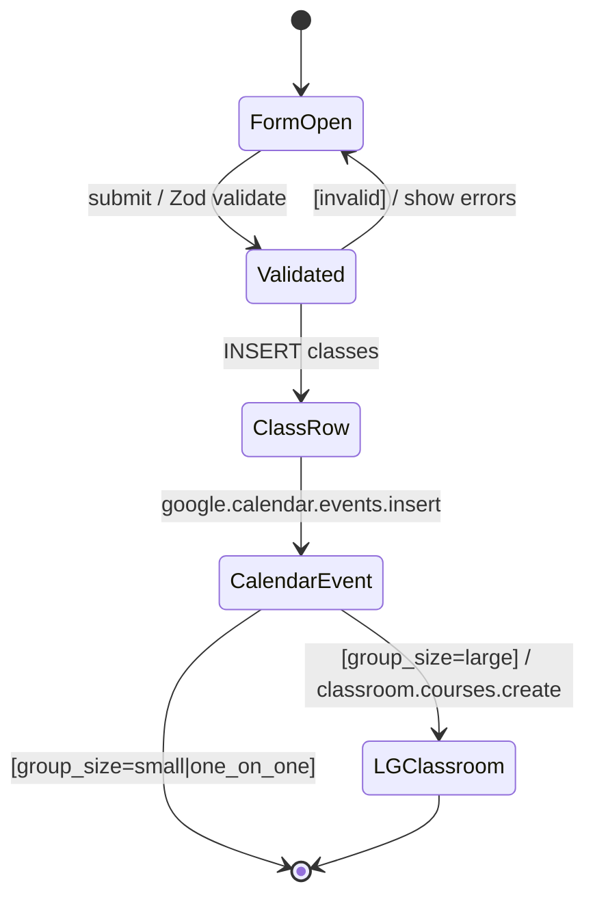

**L3 prod walk**
- [ ] Admin → `/admin/classes/new` → fill LG form (Mon+Wed, subject+level, capacity 15) → submit → class visible in list
- [ ] Check Google Calendar: recurring event exists, `UNTIL` = class end
- [ ] Check Google Classroom: course created, enrollment code stored on class row
- [ ] Create an SG class (subject=NULL, level=NULL, capacity 3) → class visible, no classroom created yet

**L1 code checkpoints**
- [ ] `src/lib/validators/class.ts` — Zod rejects subject/level on SG/1:1; requires both + 2 meeting days on LG; enforces capacity ranges
- [ ] `src/app/(dashboard)/admin/classes/actions.ts::createClassAction` — LG path creates Calendar event + Classroom; SG/1:1 path creates Calendar only
- [ ] `src/lib/google/calendar.ts` — LG uses COUNT, SG/1:1 uses UNTIL
- [ ] `src/lib/google/classroom.ts::createCourse` — only called for LG here

---

### B2. Enroll SG / 1:1 (pay now)

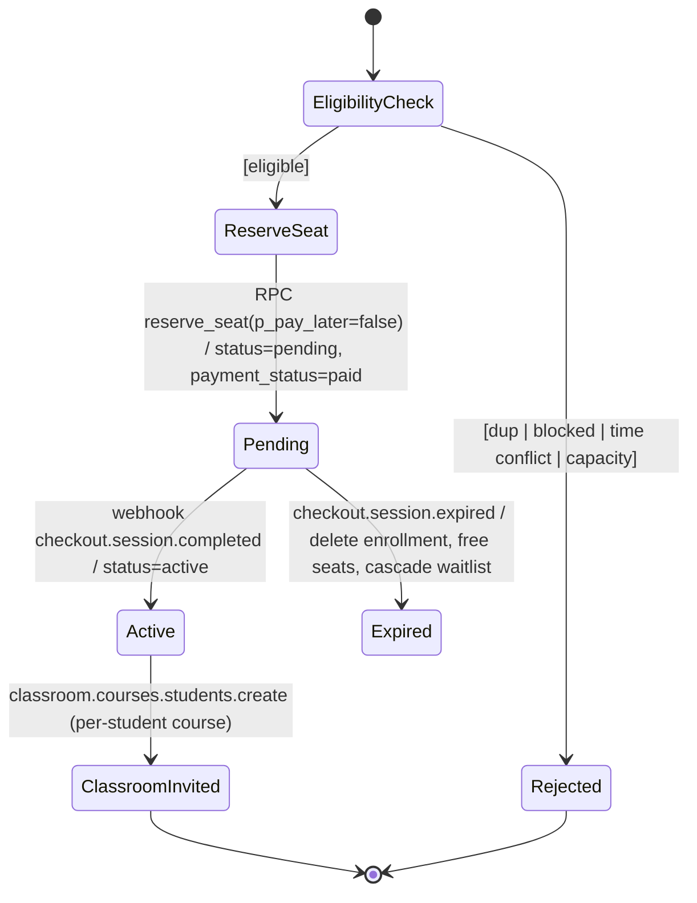

**L3 prod walk**
- [ ] Parent → `/enroll` → pick SG Mon + SG Wed → subject=`dsat_rw` → Pay Now → Stripe test card `4242 4242 4242 4242` → completes
- [ ] Webhook fires (check Stripe dashboard → Events)
- [ ] Dashboard shows enrollment `active + paid`, sessions 1–8 rendered, Classroom invite received in inbox
- [ ] Attempt same enrollment again → blocked "Already enrolled"
- [ ] Attempt enrollment with time conflict on existing slot_2 → blocked "Time conflict" (cross-slot regression)

**L1 code checkpoints**
- [ ] `src/lib/enrollment/check-eligibility.ts` — prefetches all committed (day,time) from slot_1/2/3 of active enrollments; rejects duplicates, blocked classes, time conflicts
- [ ] `src/lib/enrollment/reserve.ts` → RPC `reserve_seat` — `FOR UPDATE` row lock both slots, capacity check per slot, group_size_type match, distinct classes, agreement required
- [ ] `src/lib/stripe/create-checkout.ts` — `unit_amount = getPriceForEnrollment(groupSizeType)`, `expires_at = now + 30min`, metadata {enrollment_id, student_id, class_id}
- [ ] `src/lib/stripe/webhook-handlers.ts::handleCheckoutCompleted` — matches on enrollment_id + session_id; activates only if status ∈ (pending, active); best-effort Classroom invite for slot_1 + slot_2
- [ ] `src/lib/stripe/webhook-handlers.ts::handleCheckoutExpired` — deletes pending, reverses credits, dispatches waitlist for both slots

---

### B3. Enroll SG / 1:1 (pay later)

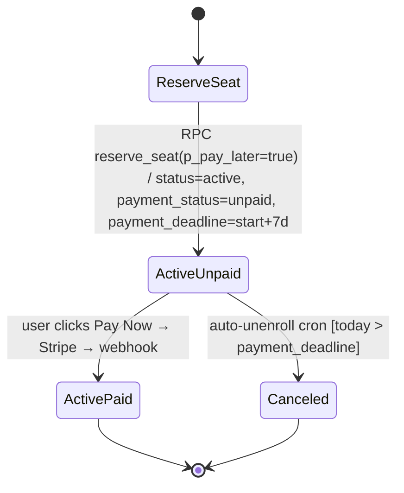

**L3 prod walk**
- [ ] Parent picks SG Mon + SG Wed → Pay Later → dashboard shows enrollment `active+unpaid`, "Pay Now" button visible, countdown shows days to `start + 7`
- [ ] Click "Pay Now" → Stripe → complete → enrollment flips to `active+paid`
- [ ] Separate enrollment: skip payment → wait past deadline → next auto-unenroll cron run cancels it, seat freed, waitlist notified

**L1 code checkpoints**
- [ ] `reserve_seat` RPC `p_pay_later=true` branch — `payment_status='unpaid'`, `payment_deadline = start + INTERVAL '7 days'`
- [ ] `src/lib/enrollment/pay-now.ts` — rejects if not `active+unpaid`, verifies student ownership, creates Stripe session
- [ ] `src/app/api/cron/auto-unenroll/route.ts` — CRON_SECRET check, finds `active+unpaid AND payment_deadline < today`, cancels + notifies + removes Classroom + dispatches waitlist

---

### B4. Enroll LG

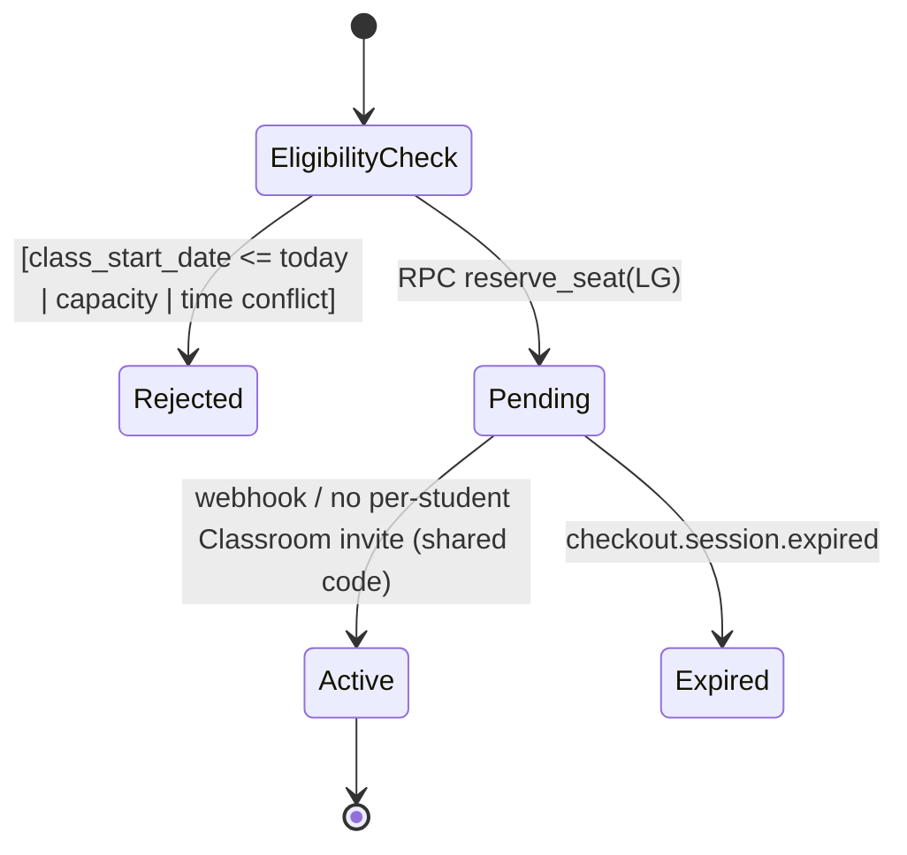

**L3 prod walk**
- [ ] Parent enrolls child in summer LG pre-start → Stripe → activated
- [ ] Dashboard shows LG with Mon+Wed sessions (8 total), subject+level inherited from class
- [ ] Attempt enrollment after `class_start_date` → blocked at eligibility AND at RPC
- [ ] LG enrollment offers no Cancel button (cancellation blocked for LG)

**L1 code checkpoints**
- [ ] `check-eligibility.ts` — LG branch rejects when `class_start_date <= today`
- [ ] `reserve_seat` LG branch — uses `class_start_date`/`class_end_date` as-is, no `student_start_date` computation
- [ ] `src/lib/scheduling/session-dates.ts::computeLgSessions` — 2 meeting days × 4 weeks = 8 sessions, chronologically sorted

---

### B5. SG Waitlist (join → offer → accept)

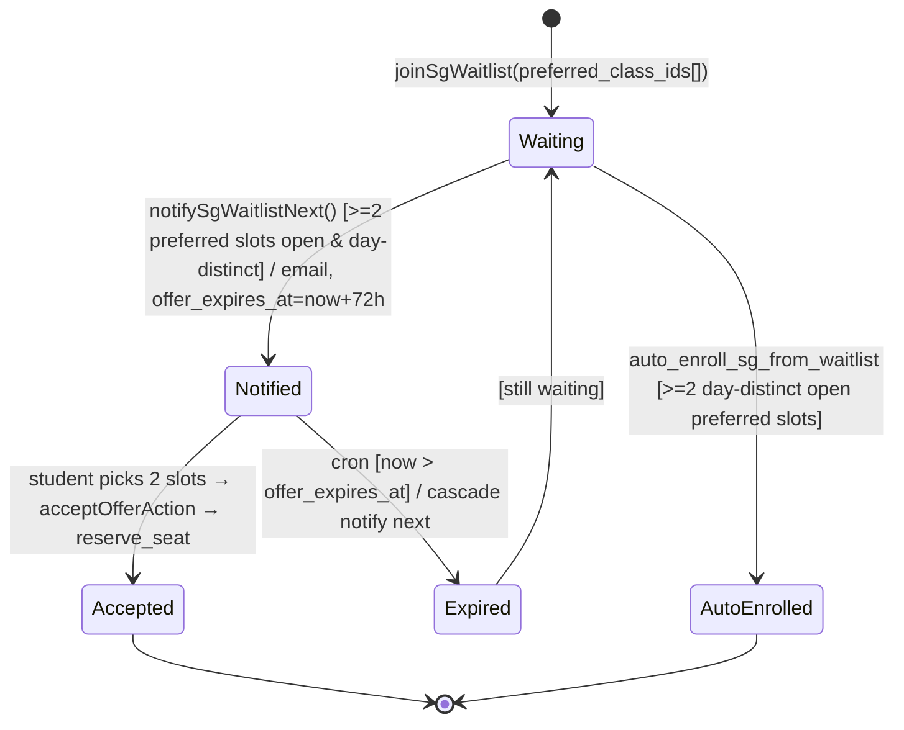

**L3 prod walk**
- [ ] Fill SG Mon to capacity (3). 4th student joins SG waitlist with preferred = {Mon, Wed, Fri} → entry `waiting`
- [ ] Drop/cancel a student in Mon → cron runs → waitlist entry either notified OR auto-enrolled into 2 day-distinct open classes (Wed + Fri, NOT two Mon classes)
- [ ] If notified: offer email received, `/enroll/waitlist-offer/[id]` shows the 2+ open preferred slots → student accepts → enrollment created

**L1 code checkpoints**
- [ ] `src/lib/waitlist/join.ts::joinSgWaitlist` — requires 2–4 preferred slots, stores agreement fields
- [ ] Migration 00091 `auto_enroll_sg_from_waitlist` — picks first preferred, then loops for day-distinct partner; skips entry if none
- [ ] `src/lib/waitlist/notify-sg-next.ts` — sets `notified_at`, `offer_expires_at = now + 72h`
- [ ] `src/lib/waitlist/notify-next.ts::expireStaleNotifications` — SG branch on `offer_expires_at`, cascades to next

---

### B6. LG Waitlist (join → auto-enroll)

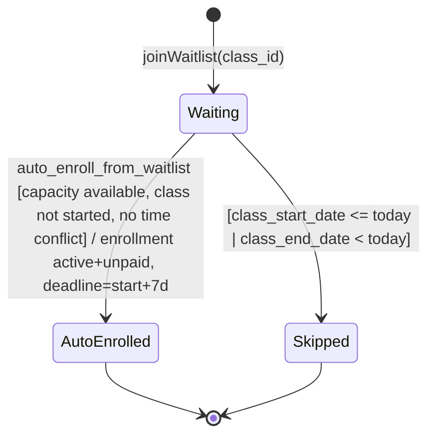

**L3 prod walk**
- [ ] Fill LG to 20. New user joins waitlist → `waiting`
- [ ] Drop one student → waitlist cron runs → next-in-FIFO auto-enrolled as `active+unpaid`, email sent, payment_deadline set

**L1 code checkpoints**
- [ ] `src/lib/waitlist/auto-enroll.ts` — calls `auto_enroll_from_waitlist` RPC
- [ ] `auto_enroll_from_waitlist` RPC — traverses slot_1/2/3 of active enrollments for time-conflict check, inserts `active+unpaid`, marks waitlist `converted`

---

### B7. Cancel session → book makeup

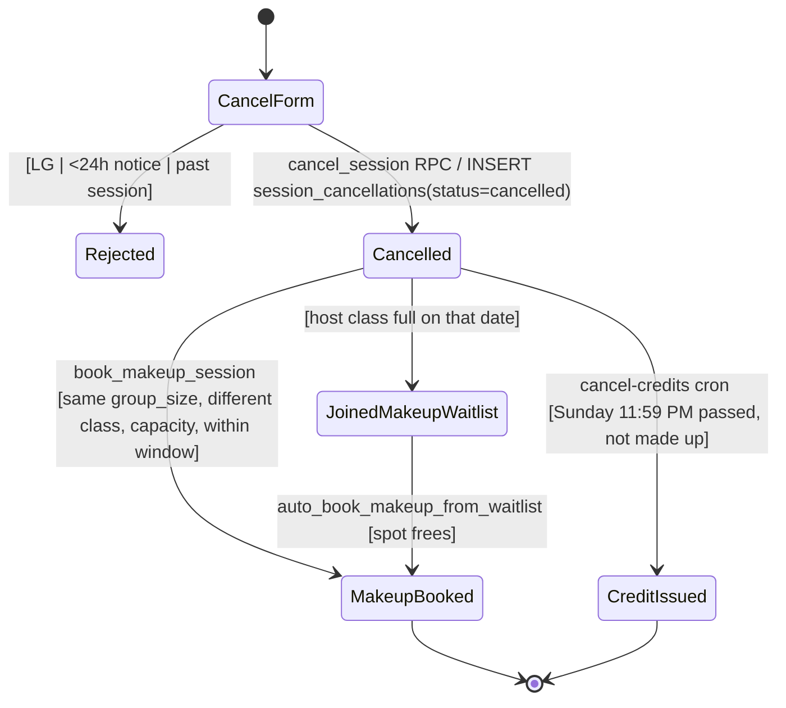

**L3 prod walk**
- [ ] Student cancels SG session 3 (slot_1, Mon) ≥24h out → `session_cancellations` row `cancelled`
- [ ] Alternate picker shows Wed/Fri SG sessions (same group_size, subject-agnostic), excludes same class
- [ ] Book Wed makeup → `makeup_bookings` row + Classroom invite
- [ ] Alternate case: skip makeup, wait past Sunday → `cancel-credits` cron issues credit

**L1 code checkpoints**
- [ ] `src/lib/cancellation/cancel-session.ts` → RPC `cancel_session` — LG block, 24h notice guard
- [ ] `src/lib/cancellation/find-alternate-sessions.ts` — same group_size_type, excludes origin class, respects enrollment window + class end_date, computes available = capacity - enrolled - booked_makeups
- [ ] `src/lib/cancellation/book-makeup.ts` → RPC `book_makeup_session`
- [ ] `src/app/api/cron/cancel-credits/route.ts` — deadline check, credit auto-issue (SG/1:1 only), LG skip

---

### B8. Redeem credit for makeup

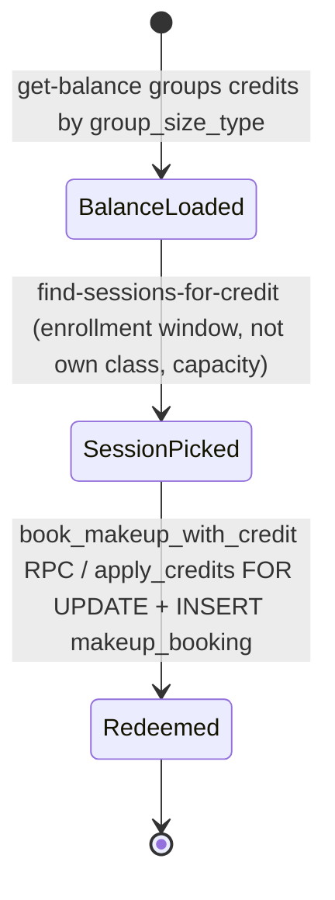

**L3 prod walk**
- [ ] Student with 1 SG credit → `/student/redeem-credit` → sees calendar with available SG makeup dates → picks one → row in `makeup_bookings`, `credits.remaining_amount` decremented

**L1 code checkpoints**
- [ ] `src/lib/credits/get-balance.ts` — `remaining_amount > 0 AND not expired`, grouped by group_size_type
- [ ] `src/lib/credits/find-sessions-for-credit.ts` — enrollment-window bounded, excludes own classes, skips same-host-class same-date duplicates
- [ ] `src/lib/credits/redeem-credit.ts` → RPC `book_makeup_with_credit` — atomic FIFO via `apply_credits FOR UPDATE`

---

### B9. Drop class (3-phase)

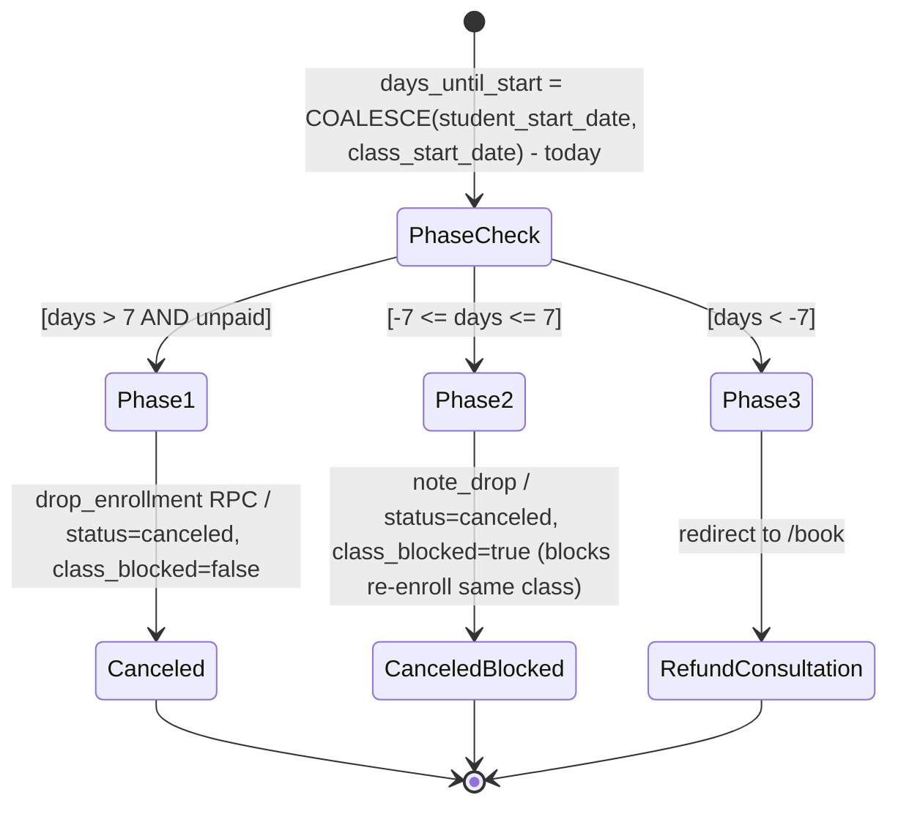

**L3 prod walk**
- [ ] Phase 1 drop (>7d before, unpaid) → self-serve succeeds; student can re-enroll same class
- [ ] Phase 2 drop (≤7d before) → note required; re-enroll same class blocked, different class allowed
- [ ] Phase 3 (>7d after start) → redirected to `/book` for refund consultation
- [ ] Any paid enrollment (any phase) → cannot self-drop, forced to consultation

**L1 code checkpoints**
- [ ] `PHASE_1_DAYS_BEFORE_START = 7` (matches RPC)
- [ ] `src/lib/enrollment/drop.ts::dropEnrollment` — removes from Classroom slot_1 + slot_2, dispatches waitlist for both
- [ ] `drop_enrollment` RPC (migration 00041) — phase boundary, `class_blocked` flag
- [ ] `check-eligibility.ts` — rejects enrollment when `class_blocked=true` for that class

---

### B10. Stripe payment lifecycle (ACH + expiry)

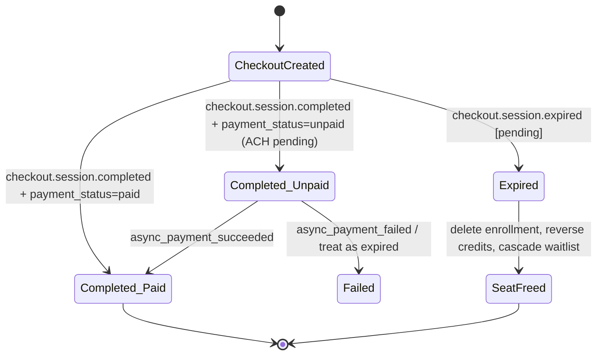

**L3 prod walk**
- [ ] Test card → immediate `completed+paid` → activated
- [ ] ACH test → `completed+unpaid` → enrollment stays pending → simulate `async_payment_succeeded` via Stripe CLI → activated
- [ ] Abandon checkout → wait 30 min → `checkout.session.expired` fires OR reconcile cron catches it → seat freed

**L1 code checkpoints**
- [ ] `webhook-handlers.ts::handleCheckoutCompleted` — `payment_status='unpaid'` path is NO-OP (wait for async)
- [ ] `webhook-handlers.ts::handleAsyncPaymentSucceeded` — re-runs activation idempotently
- [ ] `webhook-handlers.ts::handleCheckoutExpired` — pending branch deletes + cascades; deferred (active+unpaid) branch only clears `stripe_session_id`
- [ ] `webhook-handlers.ts::reconcileStripePayments` — catches missed webhooks

---

### B11. Refund request

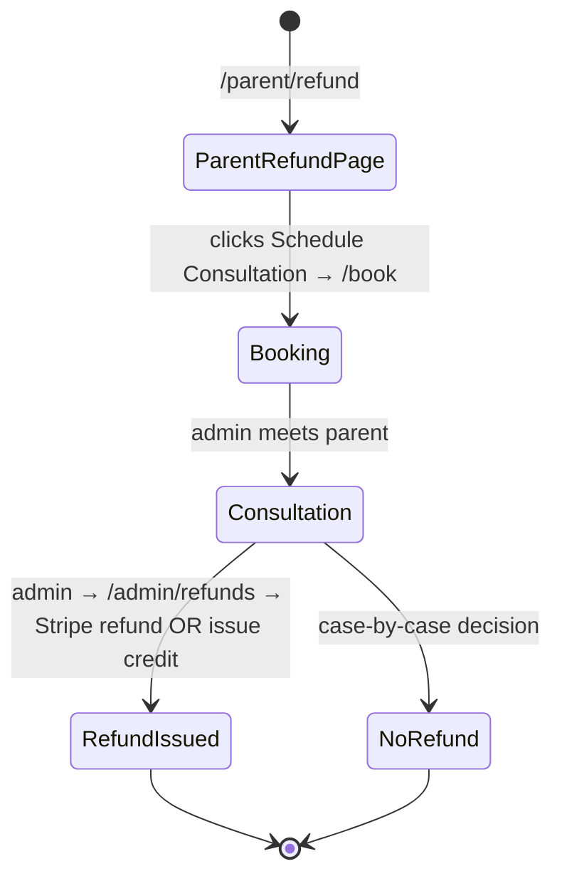

**L3 prod walk**
- [ ] Parent hits `/parent/refund` → sees explanation → books consultation via `/book`
- [ ] Admin (after meeting) goes to `/admin/refunds` → picks enrollment → issues Stripe refund OR credit → row in `admin_logs`

**L1 code checkpoints**
- [ ] `src/app/(dashboard)/parent/refund/page.tsx` — static explanation + /book link
- [ ] `src/app/(dashboard)/admin/refunds/*` — admin-only refund action, uses Stripe `refunds.create`
- [ ] RLS: parents cannot write to `refund_requests` (admin-only)

---

### B12. System automations (cron jobs)

```mermaid
stateDiagram-v2
    [*] --> Daily
    Daily --> auto_unenroll: Cancel active+unpaid past deadline
    Daily --> cancel_credits: Expire cancellations; auto-issue credits; revert no-show makeups
    Daily --> booking_reminders: hourly — SMS/email 11–12h out
    Daily --> waitlist_notify: frequent — expire offers, process queue
    Daily --> reconcile: hourly — catch missed webhooks
```

**L3 prod walk**
- [ ] Each cron is scheduled in `vercel.json`; manually trigger once via `curl -H "Authorization: Bearer $CRON_SECRET"` per endpoint → returns 200, logs show work done, no errors

**L1 code checkpoints**
- [ ] Each `src/app/api/cron/*/route.ts` — `verifyCronSecret()` guard at top
- [ ] `vercel.json` — every cron listed with schedule
- [ ] Idempotent across runs — re-running same cron produces no double-effects

---

## C. Sign-off

Fill in after walking A + B on prod.

- [ ] A1–A15 all ✅
- [ ] B1–B12 all ✅
- [ ] Test suite: `npx vitest run` — all green (349+)
- [ ] `tsc --noEmit` — zero errors
- [ ] `supabase db diff` vs local — empty
- [ ] Stripe webhook endpoint in dashboard points to prod URL, version `2026-01-28.clover`
- [ ] All Vercel cron jobs enabled
- [ ] Date signed off: __________  Signed by: __________

> Re-run this checklist after any migration, RPC change, or webhook handler change.
