# Level 3 — Component

Zooms into the Next.js application to show the library modules, their responsibilities, and how they interact.

```mermaid
flowchart TB
    subgraph pages ["Pages · src/app"]
        direction LR
        auth_pages["<b>Auth</b><br/>login, signup,<br/>onboarding, OAuth"]
        student_pages["<b>Student</b><br/>dashboard, payments,<br/>cancel, makeup, credit"]
        parent_pages["<b>Parent</b><br/>dashboard, add student,<br/>payments, cancel, credit"]
        admin_pages["<b>Admin</b><br/>classes, students, perf,<br/>credits, messages, logs"]
        enroll_pages["<b>Enrollment</b><br/>browse, select slots,<br/>checkout, waitlist"]
        public_pages["<b>Public</b><br/>landing, offerings,<br/>booking"]
    end

    subgraph lib ["Core Libraries · src/lib"]
        enrollment_lib["<b>Enrollment</b><br/>eligibility, reserve_seat<br/>RPC, 3-phase drop, pay-now"]
        cancellation_lib["<b>Cancellation</b><br/>cancel-session, book-makeup,<br/>find-alternates, makeup-waitlist"]
        credits_lib["<b>Credits</b><br/>balance, apply_credits<br/>RPC, find-sessions, redeem"]
        waitlist_lib["<b>Waitlist</b><br/>join, notify-next,<br/>auto-enroll"]
        scheduling_lib["<b>Scheduling</b><br/>computeSessionDates,<br/>computeEnrollmentSessions"]
        stripe_lib["<b>Stripe</b><br/>client, prices,<br/>create-checkout, webhooks"]
        google_lib["<b>Google</b><br/>auth, calendar,<br/>classroom, drive"]
        notifications_lib["<b>Notifications</b><br/>send-email (Resend),<br/>send-sms (Twilio)"]
        auth_lib["<b>Auth</b><br/>get-user-role, OAuth,<br/>nav-props, cron-secret"]
        supabase_lib["<b>Supabase Clients</b><br/>browser, server+RLS,<br/>admin (service role)"]
        validators_lib["<b>Validators</b><br/>Zod schemas"]
    end

    mw["<b>Middleware</b> · src/middleware.ts<br/>Auth enforcement, role routing, session refresh"]
    types["<b>Types & Constants</b> · src/lib/types.ts, constants.ts"]

    %% Pages → Libraries
    auth_pages --> auth_lib
    auth_pages --> supabase_lib
    student_pages --> enrollment_lib
    student_pages --> cancellation_lib
    student_pages --> credits_lib
    parent_pages --> enrollment_lib
    parent_pages --> cancellation_lib
    parent_pages --> credits_lib
    admin_pages --> supabase_lib
    enroll_pages --> enrollment_lib
    enroll_pages --> stripe_lib
    enroll_pages --> scheduling_lib
    enroll_pages --> waitlist_lib

    %% Library → Library
    enrollment_lib --> supabase_lib
    enrollment_lib --> scheduling_lib
    cancellation_lib --> supabase_lib
    cancellation_lib --> credits_lib
    credits_lib --> supabase_lib
    waitlist_lib --> supabase_lib
    waitlist_lib --> notifications_lib
    stripe_lib --> supabase_lib
    google_lib --> supabase_lib
    notifications_lib --> supabase_lib

    %% Middleware
    mw --> auth_lib
    mw --> supabase_lib

    style pages fill:#e8f0fe,stroke:#1168bd
    style lib fill:#fef3e8,stroke:#c8952e
    style mw fill:#1168bd,stroke:#0b4884,color:#fff
    style types fill:#f0f0f0,stroke:#999

    style auth_pages fill:#1168bd,stroke:#0b4884,color:#fff
    style student_pages fill:#1168bd,stroke:#0b4884,color:#fff
    style parent_pages fill:#1168bd,stroke:#0b4884,color:#fff
    style admin_pages fill:#1168bd,stroke:#0b4884,color:#fff
    style enroll_pages fill:#1168bd,stroke:#0b4884,color:#fff
    style public_pages fill:#1168bd,stroke:#0b4884,color:#fff

    style enrollment_lib fill:#c8952e,stroke:#a07724,color:#fff
    style cancellation_lib fill:#c8952e,stroke:#a07724,color:#fff
    style credits_lib fill:#c8952e,stroke:#a07724,color:#fff
    style waitlist_lib fill:#c8952e,stroke:#a07724,color:#fff
    style scheduling_lib fill:#c8952e,stroke:#a07724,color:#fff
    style stripe_lib fill:#c8952e,stroke:#a07724,color:#fff
    style google_lib fill:#c8952e,stroke:#a07724,color:#fff
    style notifications_lib fill:#c8952e,stroke:#a07724,color:#fff
    style auth_lib fill:#c8952e,stroke:#a07724,color:#fff
    style supabase_lib fill:#c8952e,stroke:#a07724,color:#fff
    style validators_lib fill:#c8952e,stroke:#a07724,color:#fff
```

## Module Details

### Enrollment (`src/lib/enrollment/`)

The core business flow. Handles the full lifecycle from eligibility check to active enrollment.

| File | Responsibility |
|------|---------------|
| `check-eligibility.ts` | Validates student can enroll: capacity, duplicate check, re-enrollment limits, enrollment window |
| `reserve.ts` | Calls `reserve_seat` Postgres RPC — atomically locks both slots with `FOR UPDATE`, inserts enrollment |
| `drop.ts` | 3-phase drop logic: Phase 1 (>14d before start) = self-serve; Phase 2 (<=14d to 7d after) = note + cancel; Phase 3 = refund consultation |
| `pay-now.ts` | Creates Stripe checkout session for unpaid enrollments |

### Cancellation (`src/lib/cancellation/`)

Handles session cancellations and the makeup booking flow.

| File | Responsibility |
|------|---------------|
| `cancel-session.ts` | Records cancellation, issues credit if tutor-initiated |
| `book-makeup.ts` | Books a makeup session using a credit |
| `auto-book-makeup.ts` | Automatically books into the next available compatible slot |
| `find-alternate-sessions.ts` | Finds open slots compatible with the student's enrollment for makeup |
| `join-makeup-waitlist.ts` | Joins the FIFO makeup waitlist for a full slot |

### Credits (`src/lib/credits/`)

Credits are earned from tutor-canceled sessions and redeemed for makeups.

| File | Responsibility |
|------|---------------|
| `get-balance.ts` | Returns available credit count for a student |
| `apply-credits.ts` | Calls `apply_credits` Postgres RPC — FIFO deduction with `FOR UPDATE` row locks |
| `find-sessions-for-credit.ts` | Lists eligible sessions where a credit can be used |
| `redeem-credit.ts` | End-to-end credit redemption: find slot → apply credit → book makeup |

### Waitlist (`src/lib/waitlist/`)

Two waitlist types: enrollment waitlist (class full) and makeup waitlist (makeup slot full).

| File | Responsibility |
|------|---------------|
| `join.ts` | Add student to FIFO enrollment waitlist |
| `notify-next.ts` | Pop next from queue, send notification (24h claim window) |
| `auto-enroll.ts` | When spot opens, automatically enroll the next waitlisted student |
| `send-waitlist-notification.ts` | Sends email + SMS notification for waitlist offers |

### Scheduling (`src/lib/scheduling/`)

Pure computation — no side effects.

| File | Responsibility |
|------|---------------|
| `session-dates.ts` | `computeSessionDates()` — given a slot's day/time and a start date, returns all session dates. `computeEnrollmentSessions()` — maps dual-slot enrollment to session list (odd weeks → slot 1, even → slot 2) |

### Stripe (`src/lib/stripe/`)

| File | Responsibility |
|------|---------------|
| `client.ts` | Stripe SDK initialization |
| `prices.ts` | Price lookup by group size type |
| `create-checkout.ts` | Creates Stripe Checkout session with metadata for webhook |
| `webhook-handlers.ts` | Processes `checkout.session.completed`, `async_payment_succeeded/failed` — activates enrollment, updates payment status |

### Google (`src/lib/google/`)

| File | Responsibility |
|------|---------------|
| `auth.ts` | Google service account authentication |
| `calendar.ts` | Create/update Google Calendar events for class sessions |
| `classroom.ts` | Create Google Classroom spaces (LG: per class, SG/1:1: per student) |
| `drive-folders.ts` | Organize Google Drive folders for class materials |

### Notifications (`src/lib/notifications/`)

| File | Responsibility |
|------|---------------|
| `send-email.ts` | Sends via Resend API — enrollment confirmations, waitlist notifications, reminders |
| `send-sms.ts` | Sends via Twilio API — booking reminders, waitlist alerts |
| `send-booking-notification.ts` | Combined email + SMS for booking confirmations |

### Auth (`src/lib/auth/`)

| File | Responsibility |
|------|---------------|
| `get-user-role.ts` | Resolves current user's role from Supabase session |
| `google-oauth.ts` | Google OAuth sign-in with PKCE, automatic identity linking |
| `get-nav-props.ts` | Returns navigation data based on role |
| `verify-cron-secret.ts` | Validates `CRON_SECRET` header for cron job authentication |

### Supabase Clients (`src/lib/supabase/`)

| File | Responsibility |
|------|---------------|
| `client.ts` | Browser client (anon key, respects RLS) |
| `server.ts` | Server client (anon key + cookies, respects RLS) |
| `admin.ts` | Admin client (service role key, bypasses RLS — used by cron jobs and webhooks) |

### Key Postgres RPCs

| RPC | Purpose |
|-----|---------|
| `reserve_seat` | Atomic dual-slot seat reservation with `FOR UPDATE` row locks. Accepts `p_pay_later` flag for deferred payment |
| `release_seat` | Releases reserved seats, decrements enrollment count |
| `apply_credits` | FIFO credit deduction with row-level locking — ensures no double-spend |
| `admin_set_role_parent` | Elevates a user's role to parent (admin-only) |
