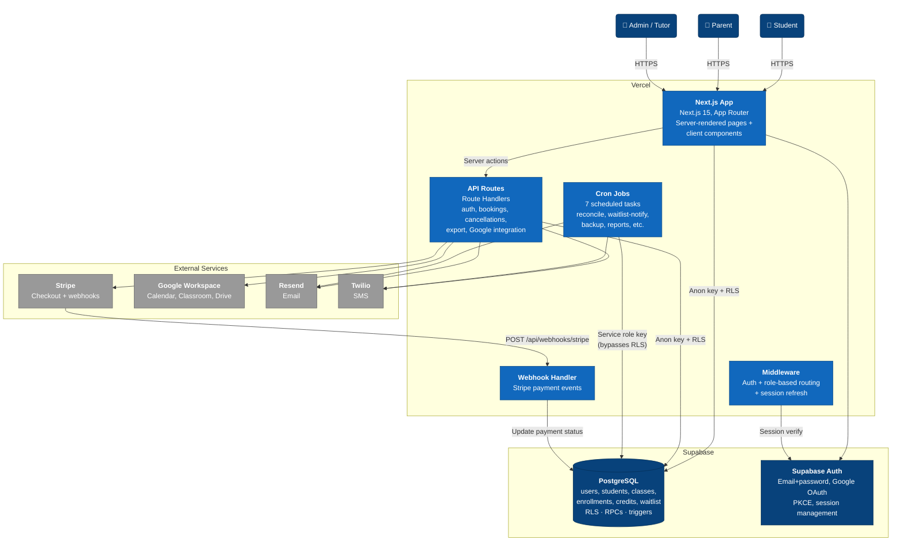

# Level 2 — Container

Zooms into the ProvableLearning system to show its runtime containers and the data flow between them.

## Containers

### Next.js App (Vercel)

The monolith — serves all pages and API routes from a single Next.js 15 deployment.

**Pages** are organized by role under the App Router:

| Route group | Description |
|-------------|-------------|
| `(auth)/` | Login, signup, onboarding, password reset, OAuth callback |
| `(dashboard)/student/` | Student dashboard, payments, cancel session, drop class, makeup, redeem credit, refund |
| `(dashboard)/parent/` | Parent dashboard, add student, payments, cancel session, drop class, redeem credit, refund |
| `(dashboard)/admin/` | Class CRUD, student management, performance logs, credits, makeups, refunds, messages, calendar, export, logs |
| `enroll/` | Class browser, enrollment flow (slot selection + Stripe checkout), waitlist offer acceptance |
| Public | Landing page (`/`), offerings (`/offerings`), booking widget (`/book`) |

### API Routes

| Group | Endpoints | Purpose |
|-------|-----------|---------|
| `/api/auth/` | google, google-setup, google-setup/callback, signout | Authentication flows |
| `/api/bookings/` | create, available-slots | Session booking |
| `/api/cancellations/` | reschedule, reschedule-slots, alternate-sessions | Cancellation + makeup |
| `/api/export/` | GET / | Data export (CSV) |
| `/api/google/` | create-calendar, create-booking-calendar, backfill-calendar, nuke-classes | Google Workspace management |
| `/api/webhooks/stripe` | POST | Payment event processing |

### Cron Jobs

Defined in `vercel.json`, each hits a Next.js API route:

| Job | Schedule | Purpose |
|-----|----------|---------|
| `/api/cron/reconcile` | Daily 6 AM | Data consistency checks |
| `/api/cron/waitlist-notify` | Every 5 min | Process waitlist queue, send notifications, auto-enroll |
| `/api/cron/backup` | Weekly Sun 3 AM | Database backup |
| `/api/cron/reports` | Monthly 1st 8 AM | Generate reports |
| `/api/cron/cancel-credits` | Every 6 hours | Expire old credits |
| `/api/cron/booking-reminders` | Hourly | Send upcoming session reminders |
| `/api/cron/auto-unenroll` | Daily 6 AM | Cancel active+unpaid enrollments past payment deadline |

All cron routes are authenticated with `CRON_SECRET`.

### Supabase PostgreSQL

90 migrations defining:

- **Core tables**: `users`, `students`, `classes`, `enrollments`, `credits`, `waitlist`, `performance_logs`, `session_cancellations`, `makeup_bookings`, `makeup_waitlist`, `notifications`, `messages`, `bookings`, `office_hours`, `refund_requests`, `admin_logs`
- **RPCs**: `reserve_seat` (atomic seat locking with `FOR UPDATE`), `release_seat`, `apply_credits` (FIFO credit deduction), `admin_set_role_parent`
- **RLS policies**: Users see own data, parents see children's data, admins see all
- **Triggers**: Role immutability, phone enforcement, agreement immutability, audit logging
- **CHECK constraints**: Capacity limits by group size type, unique performance logs

### Supabase Auth

- **Email + password** sign-up/sign-in
- **Google OAuth** with PKCE flow and automatic identity linking
- Auth callback auto-links child accounts by email match
- Parent can reset child password

### Middleware (`src/middleware.ts`)

- Enforces authentication on protected routes (redirects to `/login`)
- Role-based access control (blocks cross-role dashboard access)
- Refreshes Supabase session tokens
- **Public routes**: `/`, `/login`, `/signup`, `/book`, `/offerings`, `/api/auth/*`, `/api/webhooks/*`, `/api/cron/*`, `/api/bookings/*`

## Data Flow Highlights

1. **Enrollment**: Student browses → selects class + slots → `reserve_seat` RPC locks seats → Stripe checkout → webhook confirms payment → enrollment active
2. **Cancellation**: Cancel session → find alternate slots → book makeup using credit → `apply_credits` RPC deducts FIFO
3. **Waitlist**: Class full → join waitlist → cron notifies FIFO → student claims within 24h → auto-enroll
4. **Pay Later**: `reserve_seat(p_pay_later=true)` → active+unpaid → `auto-unenroll` cron cancels if unpaid past deadline
