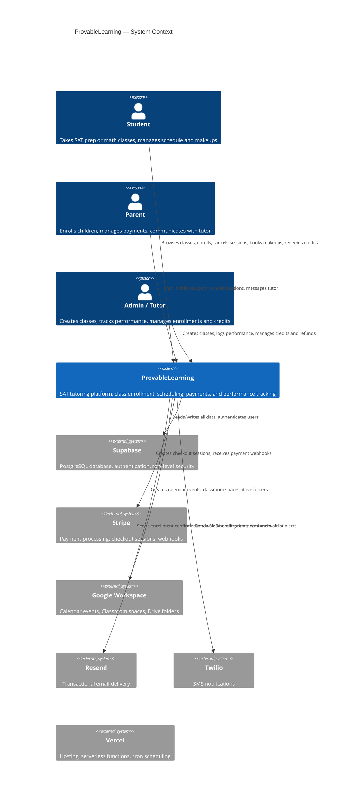

# Level 1 — System Context

The highest-level view: ProvableLearning as a single system, the people who use it, and the external services it depends on.

## Actors

| Actor | Role | Key actions |
|-------|------|-------------|
| **Student** | End user (may be independent or a parent's child) | Browse/enroll in classes, cancel sessions, book makeups, redeem credits, view performance |
| **Parent** | Guardian of one or more students | Enroll children, make payments, cancel sessions on behalf of children, message tutor |
| **Admin / Tutor** | Platform operator (seed-only, no self-registration) | Create/manage classes, log performance scores, issue credits, process refunds, view logs |

## External Systems

| System | Purpose | Integration method |
|--------|---------|-------------------|
| **Supabase** | PostgreSQL database + Auth (email/password + Google OAuth) | `@supabase/ssr` server client, `@supabase/supabase-js` browser client, admin client with service role key |
| **Stripe** | Payment processing | Stripe SDK — create checkout sessions; receive `checkout.session.completed` and `async_payment_*` webhooks |
| **Google Workspace** | Calendar (class schedules), Classroom (course materials), Drive (folder organization) | `googleapis` SDK with service account credentials |
| **Resend** | Email delivery | REST API via `resend` SDK — enrollment confirmations, waitlist notifications, reminders |
| **Twilio** | SMS delivery | REST API via `twilio` SDK — booking reminders, waitlist alerts |
| **Vercel** | Hosting + cron | Next.js deployment with 7 cron jobs (reconcile, waitlist-notify, backup, reports, cancel-credits, booking-reminders, auto-unenroll) |
